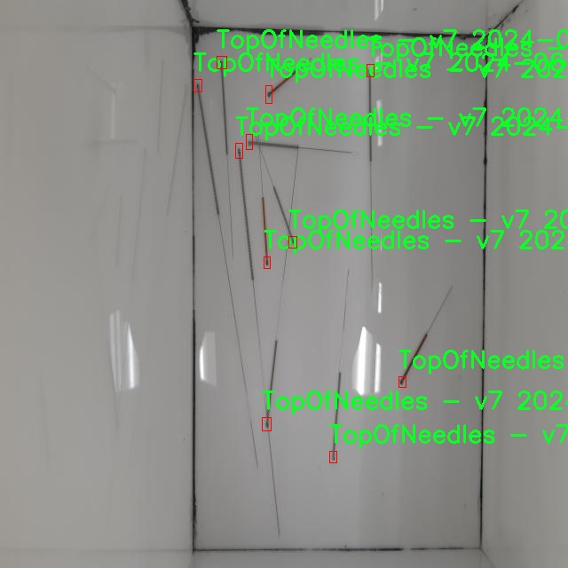

# 针头检测检测系统源码分享
 # [一条龙教学YOLOV8标注好的数据集一键训练_70+全套改进创新点发刊_Web前端展示]

### 1.研究背景与意义

项目参考[AAAI Association for the Advancement of Artificial Intelligence](https://gitee.com/qunmasj/projects)

项目来源[AACV Association for the Advancement of Computer Vision](https://kdocs.cn/l/cszuIiCKVNis)

研究背景与意义

随着医疗技术的不断进步，针头的使用在临床和实验室中变得越来越普遍。针头的精确检测和识别不仅对医疗安全至关重要，还对相关设备的自动化和智能化发展具有重要意义。传统的针头检测方法多依赖于人工观察和手动操作，效率低下且容易受到人为因素的影响。近年来，计算机视觉技术的迅猛发展为针头检测提供了新的解决方案，尤其是基于深度学习的目标检测算法，如YOLO（You Only Look Once）系列，因其高效性和准确性而受到广泛关注。

在众多YOLO版本中，YOLOv8作为最新的改进版本，具备了更强的特征提取能力和更快的推理速度，能够在复杂的环境中实现实时目标检测。针对针头这一特殊物体的检测需求，研究者们逐渐认识到，单纯依赖于现有的YOLOv8模型并不能完全满足实际应用的需求。因此，基于YOLOv8的改进针头检测系统的研究显得尤为重要。

本研究所使用的数据集“1.5HoleOfNeedles”包含3000张图像，涵盖了针头的三个主要类别：Needles_hole、TopOfNeedles等。这些数据的多样性和丰富性为模型的训练和测试提供了坚实的基础。通过对这些图像的深入分析，我们可以提取出针头在不同环境和角度下的特征信息，从而为模型的优化提供依据。数据集的构建不仅考虑了针头的外观特征，还涵盖了不同背景和光照条件下的图像，增强了模型的鲁棒性和适应性。

在此背景下，改进YOLOv8的针头检测系统的研究具有重要的理论和实践意义。首先，从理论层面来看，针对针头检测的研究将丰富目标检测领域的应用场景，推动深度学习技术在医疗器械检测中的应用发展。其次，从实践层面来看，构建一个高效、准确的针头检测系统能够大幅提高医疗操作的安全性，减少因误操作导致的医疗事故。此外，该系统还可以为医疗设备的自动化提供技术支持，提升医疗服务的效率和质量。

总之，基于改进YOLOv8的针头检测系统的研究，不仅为目标检测技术的应用提供了新的视角，也为医疗行业的智能化发展奠定了基础。通过不断优化模型和丰富数据集，我们期望能够实现更高精度的针头检测，为未来的医疗安全和效率提升做出贡献。

### 2.图片演示


##### 注意：由于此博客编辑较早，上面“2.图片演示”和“3.视频演示”展示的系统图片或者视频可能为老版本，新版本在老版本的基础上升级如下：（实际效果以升级的新版本为准）

  （1）适配了YOLOV8的“目标检测”模型和“实例分割”模型，通过加载相应的权重（.pt）文件即可自适应加载模型。

  （2）支持“图片识别”、“视频识别”、“摄像头实时识别”三种识别模式。

  （3）支持“图片识别”、“视频识别”、“摄像头实时识别”三种识别结果保存导出，解决手动导出（容易卡顿出现爆内存）存在的问题，识别完自动保存结果并导出到tempDir中。

  （4）支持Web前端系统中的标题、背景图等自定义修改，后面提供修改教程。

  另外本项目提供训练的数据集和训练教程,暂不提供权重文件（best.pt）,需要您按照教程进行训练后实现图片演示和Web前端界面演示的效果。

### 3.视频演示

[3.1 视频演示](https://www.bilibili.com/video/BV1YyxheeEzm/)

### 4.数据集信息展示

##### 4.1 本项目数据集详细数据（类别数＆类别名）

nc: 2
names: ['-', 'TopOfNeedles - v7 2024-06-21 7-32am_an_original_size']


##### 4.2 本项目数据集信息介绍

数据集信息展示

在现代计算机视觉领域，针头检测系统的研究与应用正逐渐成为一个重要的研究方向。为了推动这一领域的进步，我们构建了一个名为“1.5HoleOfNeedles”的数据集，旨在为改进YOLOv8模型提供高质量的训练数据。该数据集专注于针头的检测与识别，尤其是在医疗和工业应用中，针头的准确定位至关重要。

“1.5HoleOfNeedles”数据集包含两个主要类别，分别为“无”（-）和“TopOfNeedles - v7 2024-06-21 7-32am_an_original_size”。其中，“无”类别用于标识图像中不存在针头的情况，而“TopOfNeedles”则专注于针头的顶部特征。这种分类方式的设计旨在帮助模型在处理复杂场景时，能够准确区分针头的存在与否，从而提高检测的准确性和鲁棒性。

数据集的构建过程涉及多个步骤，首先是数据的收集。我们从多个来源获取了大量的针头图像，这些图像涵盖了不同的拍摄角度、光照条件和背景环境。通过对这些图像进行标注，我们确保每一张图像都被准确地分类为“无”或“TopOfNeedles”。这种精细的标注过程不仅提高了数据集的质量，也为后续的模型训练奠定了坚实的基础。

在数据集的预处理阶段，我们对图像进行了多种增强操作，以提高模型的泛化能力。这些操作包括随机裁剪、旋转、缩放和颜色调整等，旨在模拟真实场景中可能出现的各种变化。通过这种方式，我们不仅丰富了数据集的多样性，还提高了模型在实际应用中的适应能力。

此外，为了确保数据集的代表性，我们特别关注了针头在不同应用场景中的表现。例如，在医疗环境中，针头的形态和尺寸可能与工业环境中的针头有所不同。因此，我们在数据集中纳入了多种类型的针头图像，以便模型能够学习到不同类型针头的特征。这种多样性使得“1.5HoleOfNeedles”数据集不仅适用于特定类型的针头检测任务，也为更广泛的应用提供了支持。

在模型训练过程中，我们将“1.5HoleOfNeedles”数据集与YOLOv8模型相结合，旨在通过不断迭代和优化，提高针头检测的精度和速度。YOLOv8作为一种先进的目标检测模型，具有快速的推理速度和高效的特征提取能力，能够在实时应用中表现出色。通过对数据集的精心设计和模型的不断改进，我们期望能够实现更高的检测准确率，为针头检测技术的发展贡献力量。

总之，“1.5HoleOfNeedles”数据集的构建不仅为针头检测系统的研究提供了宝贵的数据支持，也为相关领域的学术研究和实际应用开辟了新的可能性。随着技术的不断进步，我们相信这一数据集将在未来的研究中发挥重要作用，推动针头检测技术的不断演进与创新。





### 5.全套项目环境部署视频教程（零基础手把手教学）

[5.1 环境部署教程链接（零基础手把手教学）](https://www.ixigua.com/7404473917358506534?logTag=c807d0cbc21c0ef59de5)


[5.2 安装Python虚拟环境创建和依赖库安装视频教程链接（零基础手把手教学）](https://www.ixigua.com/7404474678003106304?logTag=1f1041108cd1f708b01a)

### 6.手把手YOLOV8训练视频教程（零基础小白有手就能学会）

[6.1 手把手YOLOV8训练视频教程（零基础小白有手就能学会）](https://www.ixigua.com/7404477157818401292?logTag=d31a2dfd1983c9668658)

### 7.70+种全套YOLOV8创新点代码加载调参视频教程（一键加载写好的改进模型的配置文件）

[7.1 70+种全套YOLOV8创新点代码加载调参视频教程（一键加载写好的改进模型的配置文件）](https://www.ixigua.com/7404478314661806627?logTag=29066f8288e3f4eea3a4)

### 8.70+种全套YOLOV8创新点原理讲解（非科班也可以轻松写刊发刊，V10版本正在科研待更新）

由于篇幅限制，每个创新点的具体原理讲解就不一一展开，具体见下列网址中的创新点对应子项目的技术原理博客网址【Blog】：


[8.1 70+种全套YOLOV8创新点原理讲解链接](https://gitee.com/qunmasj/good)

### 9.系统功能展示（检测对象为举例，实际内容以本项目数据集为准）

图9.1.系统支持检测结果表格显示

  图9.2.系统支持置信度和IOU阈值手动调节

  图9.3.系统支持自定义加载权重文件best.pt(需要你通过步骤5中训练获得)

  图9.4.系统支持摄像头实时识别

  图9.5.系统支持图片识别

  图9.6.系统支持视频识别

  图9.7.系统支持识别结果文件自动保存

  图9.8.系统支持Excel导出检测结果数据


### 10.原始YOLOV8算法原理

原始YOLOv8算法原理

YOLOv8算法是目标检测领域的一个重要里程碑，继承了YOLO系列算法的优良传统，并在此基础上进行了多项创新与优化。该算法由Glenn Jocher提出，旨在通过改进网络结构和训练策略，进一步提升目标检测的精度和速度。YOLOv8的核心理念是实现高效的实时目标检测，同时保持对多尺度目标的良好适应性。其网络结构主要分为三个部分：Backbone、Neck和Head，每个部分在整体架构中扮演着不可或缺的角色。

在Backbone部分，YOLOv8采用了一系列卷积和反卷积层，以提取输入图像的特征。与前代YOLO版本相比，YOLOv8引入了C2模块作为基本构成单元，取代了YOLOv5中的C3模块。C2模块通过引入更多的分支结构，丰富了梯度流动的信息，使得网络在训练过程中能够更有效地传递信息。这种设计不仅提高了特征提取的效率，还增强了网络的表现力。此外，Backbone中还使用了残差连接和瓶颈结构，以减小网络的大小并提升性能。具体而言，YOLOv8的Backbone由5个CBS模块、4个C2f模块和1个快速空间金字塔池化（SPPF）模块组成。SPPF模块通过不同内核尺寸的池化操作，进一步合并特征图，为后续的特征融合提供了更加丰富的信息。

Neck部分则负责多尺度特征的融合。YOLOv8采用了双塔结构，将特征金字塔网络（FPN）与路径聚合网络（PAN）相结合，以促进语义特征和定位特征的有效转移。这种设计使得网络能够更好地捕捉不同尺度目标的信息，从而提高了目标检测的性能和鲁棒性。通过将来自Backbone不同阶段的特征图进行融合，YOLOv8能够有效地处理各种尺寸的目标，增强了对小目标和大目标的检测能力。

在Head部分，YOLOv8负责最终的目标检测和分类任务。该部分设有三个检测头，采用解耦头的结构，将回归分支和预测分支进行分离。这样的设计使得模型在处理分类和定位任务时能够更加高效，从而加速了模型的收敛过程。每个检测头包含一系列卷积层和反卷积层，最终生成检测结果。解耦头的引入不仅提升了模型的灵活性，还提高了检测精度，使得YOLOv8在多种应用场景中表现出色。

YOLOv8在数据预处理方面也进行了优化，采用了包括马赛克增强、混合增强、空间扰动和颜色扰动等多种增强手段。这些增强策略旨在提高模型的泛化能力，使其在面对不同类型的输入数据时依然能够保持良好的性能。通过这些数据增强技术，YOLOv8能够有效地提升训练数据的多样性，从而提高模型的鲁棒性。

在标签分配策略上，YOLOv8摒弃了传统的候选框聚类方法，采用了动态标签分配策略。这一策略通过对正负样本进行多尺度分配，解决了样本匹配的问题。YOLOv8的损失函数主要包括类别损失和位置损失，其中类别损失采用了变焦损失（Varifocal Loss），而回归损失则结合了CIoU Loss与DFL Loss。变焦损失通过对正负样本进行加权，使得模型在训练过程中能够更加关注高质量的正样本，从而有效提升检测精度。

综上所述，YOLOv8算法通过对网络结构的创新、数据预处理的优化以及标签分配策略的改进，显著提升了目标检测的性能。其在实时性和准确性方面的优势，使得YOLOv8成为了目标检测领域的重要工具，广泛应用于智能监控、自动驾驶、无人机等多个领域。随着技术的不断进步，YOLOv8无疑将在未来的研究和应用中发挥更大的作用。


### 11.项目核心源码讲解（再也不用担心看不懂代码逻辑）

#### 11.1 ui.py

以下是经过简化和注释的核心代码：

```python
import sys
import subprocess
from QtFusion.path import abs_path

def run_script(script_path):
    """
    使用当前 Python 环境运行指定的脚本。

    Args:
        script_path (str): 要运行的脚本路径
    """
    # 获取当前 Python 解释器的路径
    python_path = sys.executable

    # 构建运行命令，使用 streamlit 运行指定的脚本
    command = f'"{python_path}" -m streamlit run "{script_path}"'

    # 执行命令并等待其完成
    result = subprocess.run(command, shell=True)
    
    # 检查命令执行结果，如果返回码不为0，表示出错
    if result.returncode != 0:
        print("脚本运行出错。")

# 主程序入口
if __name__ == "__main__":
    # 获取脚本的绝对路径
    script_path = abs_path("web.py")

    # 运行指定的脚本
    run_script(script_path)
```

### 代码注释说明：

1. **导入模块**：
   - `sys`：用于访问与 Python 解释器紧密相关的变量和函数。
   - `subprocess`：用于执行外部命令。
   - `abs_path`：从 `QtFusion.path` 导入的函数，用于获取文件的绝对路径。

2. **`run_script` 函数**：
   - 接受一个参数 `script_path`，表示要运行的 Python 脚本的路径。
   - 使用 `sys.executable` 获取当前 Python 解释器的路径。
   - 构建一个命令字符串，用于运行 `streamlit` 应用。
   - 使用 `subprocess.run` 执行命令，并等待其完成。
   - 检查命令的返回码，如果不为0，表示执行过程中出现错误，打印错误信息。

3. **主程序入口**：
   - 通过 `if __name__ == "__main__":` 确保代码仅在直接运行时执行。
   - 使用 `abs_path` 获取 `web.py` 的绝对路径。
   - 调用 `run_script` 函数来运行指定的脚本。

这个程序文件名为 `ui.py`，其主要功能是运行一个指定的 Python 脚本，具体是通过 Streamlit 框架来启动一个 Web 应用。

首先，文件中导入了一些必要的模块，包括 `sys`、`os` 和 `subprocess`。其中，`sys` 模块用于访问与 Python 解释器相关的变量和函数，`os` 模块提供了与操作系统交互的功能，而 `subprocess` 模块则用于创建新进程、连接到它们的输入/输出/错误管道，并获取它们的返回码。

接下来，文件中定义了一个名为 `run_script` 的函数，该函数接受一个参数 `script_path`，表示要运行的脚本的路径。在函数内部，首先获取当前 Python 解释器的路径，这通过 `sys.executable` 实现。然后，构建一个命令字符串，使用当前的 Python 解释器和 Streamlit 模块来运行指定的脚本。命令的格式是 `"{python_path}" -m streamlit run "{script_path}"`，这意味着使用 Python 解释器来执行 Streamlit，并指定要运行的脚本。

随后，使用 `subprocess.run` 方法来执行构建好的命令，并通过 `shell=True` 参数允许在 shell 中执行该命令。执行后，函数会检查返回码，如果返回码不为 0，表示脚本运行出错，则打印出错信息。

在文件的最后部分，使用 `if __name__ == "__main__":` 语句来确保只有在直接运行该脚本时才会执行以下代码。这里指定了要运行的脚本路径 `script_path`，该路径通过调用 `abs_path("web.py")` 获取，`abs_path` 函数可能是一个自定义函数，用于获取文件的绝对路径。最后，调用 `run_script(script_path)` 来运行指定的脚本。

总体来说，这个程序的作用是为用户提供一个简单的接口，以便在当前的 Python 环境中启动一个基于 Streamlit 的 Web 应用。

#### 11.2 70+种YOLOv8算法改进源码大全和调试加载训练教程（非必要）\ultralytics\data\build.py

以下是代码中最核心的部分，并附上详细的中文注释：

```python
import os
import random
import numpy as np
import torch
from torch.utils.data import dataloader, distributed
from .dataset import YOLODataset
from .utils import PIN_MEMORY

class InfiniteDataLoader(dataloader.DataLoader):
    """
    无限数据加载器，重用工作线程。

    该类的语法与普通的 DataLoader 相同。
    """

    def __init__(self, *args, **kwargs):
        """初始化无限数据加载器，继承自 DataLoader。"""
        super().__init__(*args, **kwargs)
        # 使用 _RepeatSampler 来无限循环采样
        object.__setattr__(self, 'batch_sampler', _RepeatSampler(self.batch_sampler))
        self.iterator = super().__iter__()

    def __len__(self):
        """返回批次采样器的长度。"""
        return len(self.batch_sampler.sampler)

    def __iter__(self):
        """创建一个无限重复的采样器。"""
        for _ in range(len(self)):
            yield next(self.iterator)

    def reset(self):
        """
        重置迭代器。

        当我们想在训练过程中修改数据集设置时，这个方法非常有用。
        """
        self.iterator = self._get_iterator()


class _RepeatSampler:
    """
    永久重复的采样器。

    参数:
        sampler (Dataset.sampler): 要重复的采样器。
    """

    def __init__(self, sampler):
        """初始化一个对象，该对象无限重复给定的采样器。"""
        self.sampler = sampler

    def __iter__(self):
        """迭代 'sampler' 并返回其内容。"""
        while True:
            yield from iter(self.sampler)


def seed_worker(worker_id):
    """设置数据加载器工作线程的随机种子。"""
    worker_seed = torch.initial_seed() % 2 ** 32  # 获取当前线程的随机种子
    np.random.seed(worker_seed)  # 设置 numpy 随机种子
    random.seed(worker_seed)  # 设置 random 随机种子


def build_yolo_dataset(cfg, img_path, batch, data, mode='train', rect=False, stride=32):
    """构建 YOLO 数据集。"""
    return YOLODataset(
        img_path=img_path,  # 图像路径
        imgsz=cfg.imgsz,  # 图像大小
        batch_size=batch,  # 批次大小
        augment=mode == 'train',  # 是否进行数据增强
        hyp=cfg,  # 超参数配置
        rect=cfg.rect or rect,  # 是否使用矩形批次
        cache=cfg.cache or None,  # 是否缓存数据
        single_cls=cfg.single_cls or False,  # 是否使用单类
        stride=int(stride),  # 步幅
        pad=0.0 if mode == 'train' else 0.5,  # 填充
        prefix=colorstr(f'{mode}: '),  # 模式前缀
        use_segments=cfg.task == 'segment',  # 是否使用分割
        use_keypoints=cfg.task == 'pose',  # 是否使用关键点
        classes=cfg.classes,  # 类别
        data=data,  # 数据配置
        fraction=cfg.fraction if mode == 'train' else 1.0  # 训练时的数据比例
    )


def build_dataloader(dataset, batch, workers, shuffle=True, rank=-1):
    """返回用于训练或验证集的 InfiniteDataLoader 或 DataLoader。"""
    batch = min(batch, len(dataset))  # 确保批次大小不超过数据集大小
    nd = torch.cuda.device_count()  # 获取 CUDA 设备数量
    nw = min([os.cpu_count() // max(nd, 1), batch if batch > 1 else 0, workers])  # 计算工作线程数量
    sampler = None if rank == -1 else distributed.DistributedSampler(dataset, shuffle=shuffle)  # 分布式采样器
    generator = torch.Generator()  # 创建随机数生成器
    generator.manual_seed(6148914691236517205 + RANK)  # 设置随机种子
    return InfiniteDataLoader(dataset=dataset,
                              batch_size=batch,
                              shuffle=shuffle and sampler is None,
                              num_workers=nw,
                              sampler=sampler,
                              pin_memory=PIN_MEMORY,
                              collate_fn=getattr(dataset, 'collate_fn', None),
                              worker_init_fn=seed_worker,
                              generator=generator)  # 返回无限数据加载器


def check_source(source):
    """检查源类型并返回相应的标志值。"""
    webcam, screenshot, from_img, in_memory, tensor = False, False, False, False, False
    if isinstance(source, (str, int, Path)):  # 如果源是字符串、整数或路径
        source = str(source)
        is_file = Path(source).suffix[1:] in (IMG_FORMATS + VID_FORMATS)  # 检查是否为文件
        is_url = source.lower().startswith(('https://', 'http://', 'rtsp://', 'rtmp://', 'tcp://'))  # 检查是否为 URL
        webcam = source.isnumeric() or source.endswith('.streams') or (is_url and not is_file)  # 检查是否为网络摄像头
        screenshot = source.lower() == 'screen'  # 检查是否为屏幕截图
        if is_url and is_file:
            source = check_file(source)  # 下载文件
    elif isinstance(source, LOADERS):
        in_memory = True  # 如果源是加载器，设置为内存中
    elif isinstance(source, (list, tuple)):
        source = autocast_list(source)  # 将列表中的所有元素转换为 PIL 或 np 数组
        from_img = True
    elif isinstance(source, (Image.Image, np.ndarray)):
        from_img = True  # 如果源是图像或数组
    elif isinstance(source, torch.Tensor):
        tensor = True  # 如果源是张量
    else:
        raise TypeError('不支持的图像类型。有关支持的类型，请参见文档。')

    return source, webcam, screenshot, from_img, in_memory, tensor


def load_inference_source(source=None, imgsz=640, vid_stride=1, buffer=False):
    """
    加载用于目标检测的推理源并应用必要的转换。

    参数:
        source (str, Path, Tensor, PIL.Image, np.ndarray): 输入推理源。
        imgsz (int, optional): 推理图像的大小。默认值为 640。
        vid_stride (int, optional): 视频源的帧间隔。默认值为 1。
        buffer (bool, optional): 确定流帧是否会被缓冲。默认值为 False。

    返回:
        dataset (Dataset): 指定输入源的数据集对象。
    """
    source, webcam, screenshot, from_img, in_memory, tensor = check_source(source)  # 检查源类型
    source_type = source.source_type if in_memory else SourceTypes(webcam, screenshot, from_img, tensor)  # 确定源类型

    # 根据源类型加载数据集
    if tensor:
        dataset = LoadTensor(source)  # 加载张量
    elif in_memory:
        dataset = source  # 使用内存中的数据
    elif webcam:
        dataset = LoadStreams(source, imgsz=imgsz, vid_stride=vid_stride, buffer=buffer)  # 加载网络摄像头流
    elif screenshot:
        dataset = LoadScreenshots(source, imgsz=imgsz)  # 加载屏幕截图
    elif from_img:
        dataset = LoadPilAndNumpy(source, imgsz=imgsz)  # 加载 PIL 或 numpy 图像
    else:
        dataset = LoadImages(source, imgsz=imgsz, vid_stride=vid_stride)  # 加载图像文件

    # 将源类型附加到数据集
    setattr(dataset, 'source_type', source_type)

    return dataset  # 返回数据集对象
```

以上代码主要实现了一个用于YOLO目标检测的无限数据加载器和数据集构建功能。它包括对数据源的检查、数据集的构建以及自定义的数据加载器。通过这些功能，可以有效地处理大规模数据集并支持不同类型的数据源。

这个程序文件是用于构建YOLOv8算法的数据加载器和数据集管理的部分代码。它主要包含了数据加载、数据集构建、数据源检查等功能，以便于在训练和推理过程中高效地处理图像和视频数据。

首先，文件引入了一些必要的库，包括操作系统相关的库、随机数生成库、路径处理库、NumPy、PyTorch及其数据加载模块、PIL图像处理库等。这些库为后续的数据处理和模型训练提供了基础支持。

接下来，定义了一个名为`InfiniteDataLoader`的类，它继承自PyTorch的`DataLoader`。这个类的主要特点是可以无限循环地重用工作线程，从而在训练过程中保持数据流的连续性。它重写了`__len__`和`__iter__`方法，使得数据加载器可以在每个epoch中不断迭代数据。此外，`reset`方法允许在训练过程中重置迭代器，以便于在修改数据集设置时使用。

`_RepeatSampler`类则是一个无限重复的采样器，它可以在训练过程中不断返回相同的数据样本，确保数据加载的稳定性。

`seed_worker`函数用于设置数据加载器工作线程的随机种子，以确保在多线程环境下的随机性一致性。这对于模型训练中的数据增强等操作非常重要。

`build_yolo_dataset`函数用于构建YOLO数据集，接收配置参数、图像路径、批量大小等信息，返回一个`YOLODataset`对象。这个函数根据不同的训练模式（如训练或验证）设置数据增强、批量处理等参数。

`build_dataloader`函数则是根据传入的数据集、批量大小、工作线程数等信息返回一个`InfiniteDataLoader`或标准的`DataLoader`。它还考虑了分布式训练的情况，通过`DistributedSampler`来处理多GPU训练的样本分配。

`check_source`函数用于检查输入数据源的类型，支持多种输入格式，包括文件路径、URL、图像、视频流等。它返回相应的标志值，以便后续处理。

最后，`load_inference_source`函数用于加载推理数据源，支持不同类型的输入，并根据输入类型选择合适的数据加载方式。它会根据输入的源类型（如图像、视频流等）创建相应的加载器，并将源类型信息附加到数据集对象上。

总体而言，这个文件为YOLOv8模型的训练和推理提供了灵活而高效的数据处理机制，确保在处理不同类型的数据时能够适应各种需求。

#### 11.3 70+种YOLOv8算法改进源码大全和调试加载训练教程（非必要）\ultralytics\utils\checks.py

以下是经过简化并添加详细中文注释的核心代码部分：

```python
import os
import re
import subprocess
from pathlib import Path
from typing import Optional
import torch
from ultralytics.utils import LOGGER, ROOT

def parse_requirements(file_path=ROOT.parent / 'requirements.txt', package=''):
    """
    解析 requirements.txt 文件，忽略以 '#' 开头的行和 '#' 后的文本。

    参数:
        file_path (Path): requirements.txt 文件的路径。
        package (str, optional): 用于替代 requirements.txt 文件的 Python 包名，例如 package='ultralytics'。

    返回:
        (List[Dict[str, str]]): 解析后的要求列表，每个要求为包含 `name` 和 `specifier` 键的字典。
    """
    # 如果指定了包名，则从该包的依赖中获取要求
    if package:
        requires = [x for x in metadata.distribution(package).requires if 'extra == ' not in x]
    else:
        requires = Path(file_path).read_text().splitlines()  # 读取文件内容

    requirements = []
    for line in requires:
        line = line.strip()
        if line and not line.startswith('#'):  # 忽略空行和注释行
            line = line.split('#')[0].strip()  # 忽略行内注释
            match = re.match(r'([a-zA-Z0-9-_]+)\s*([<>!=~]+.*)?', line)  # 匹配包名和版本规范
            if match:
                requirements.append(SimpleNamespace(name=match[1], specifier=match[2].strip() if match[2] else ''))

    return requirements

def check_version(current: str = '0.0.0', required: str = '0.0.0', name: str = 'version', hard: bool = False) -> bool:
    """
    检查当前版本是否满足所需版本或范围。

    参数:
        current (str): 当前版本或要获取版本的包名。
        required (str): 所需版本或范围（以 pip 风格格式）。
        name (str, optional): 在警告消息中使用的名称。
        hard (bool, optional): 如果为 True，则在不满足要求时引发 AssertionError。

    返回:
        (bool): 如果满足要求则返回 True，否则返回 False。
    """
    if not current:  # 如果 current 为空
        LOGGER.warning(f'WARNING ⚠️ invalid check_version({current}, {required}) requested, please check values.')
        return True

    # 处理包名获取版本
    if not current[0].isdigit():
        try:
            name = current  # 将包名赋值给 'name' 参数
            current = metadata.version(current)  # 从包名获取版本字符串
        except metadata.PackageNotFoundError:
            if hard:
                raise ModuleNotFoundError(f'WARNING ⚠️ {current} package is required but not installed')
            else:
                return False

    # 如果没有要求，直接返回 True
    if not required:
        return True

    result = True
    c = parse_version(current)  # 将版本字符串解析为元组
    for r in required.strip(',').split(','):
        op, v = re.match(r'([^0-9]*)([\d.]+)', r).groups()  # 分离操作符和版本号
        v = parse_version(v)  # 将版本字符串解析为元组
        # 根据操作符检查版本
        if op == '==' and c != v:
            result = False
        elif op == '!=' and c == v:
            result = False
        elif op in ('>=', '') and not (c >= v):
            result = False
        elif op == '<=' and not (c <= v):
            result = False
        elif op == '>' and not (c > v):
            result = False
        elif op == '<' and not (c < v):
            result = False

    if not result:
        warning_message = f'WARNING ⚠️ {name}{op}{required} is required, but {name}=={current} is currently installed'
        if hard:
            raise ModuleNotFoundError(warning_message)  # 确保版本要求满足
        LOGGER.warning(warning_message)
    return result

def check_python(minimum: str = '3.8.0') -> bool:
    """
    检查当前 Python 版本是否满足所需的最低版本。

    参数:
        minimum (str): 所需的最低 Python 版本。

    返回:
        None
    """
    return check_version(platform.python_version(), minimum, name='Python ', hard=True)

def check_file(file, suffix='', download=True, hard=True):
    """搜索/下载文件（如有必要）并返回路径。"""
    check_suffix(file, suffix)  # 可选检查后缀
    file = str(file).strip()  # 转换为字符串并去除空格
    if not file or ('://' not in file and Path(file).exists()):  # 检查文件是否存在
        return file
    elif download and file.lower().startswith(('https://', 'http://')):  # 下载文件
        url = file
        file = url2file(file)  # 处理 URL
        if Path(file).exists():
            LOGGER.info(f'Found {clean_url(url)} locally at {file}')  # 文件已存在
        else:
            downloads.safe_download(url=url, file=file, unzip=False)  # 下载文件
        return file
    else:  # 搜索文件
        files = glob.glob(str(ROOT / '**' / file), recursive=True)  # 查找文件
        if not files and hard:
            raise FileNotFoundError(f"'{file}' does not exist")
        elif len(files) > 1 and hard:
            raise FileNotFoundError(f"Multiple files match '{file}', specify exact path: {files}")
        return files[0] if len(files) else []  # 返回文件

def check_imshow(warn=False):
    """检查环境是否支持图像显示。"""
    try:
        cv2.imshow('test', np.zeros((8, 8, 3), dtype=np.uint8))  # 显示一个小图像
        cv2.waitKey(1)
        cv2.destroyAllWindows()
        return True
    except Exception as e:
        if warn:
            LOGGER.warning(f'WARNING ⚠️ Environment does not support cv2.imshow() or PIL Image.show()\n{e}')
        return False
```

### 代码核心部分解释：
1. **`parse_requirements`**: 解析 `requirements.txt` 文件，提取出需要的包名和版本信息。
2. **`check_version`**: 检查当前版本是否满足指定的版本要求。
3. **`check_python`**: 检查当前 Python 版本是否满足最低要求。
4. **`check_file`**: 检查文件是否存在，必要时下载文件。
5. **`check_imshow`**: 检查当前环境是否支持图像显示功能。

这些函数是整个代码的核心，主要用于处理依赖关系、版本检查和文件管理等基本功能。

这个程序文件是YOLOv8算法改进的工具类，主要用于检查和验证环境、依赖项、版本等，以确保YOLOv8能够正常运行。文件中包含多个函数，每个函数的功能如下：

首先，`parse_requirements`函数用于解析`requirements.txt`文件，提取出需要的Python包及其版本要求。它会忽略以`#`开头的注释行，并将每一行解析为字典形式，包含包名和版本规范。

接下来，`parse_version`函数将版本字符串转换为整数元组，方便进行版本比较。它会忽略版本字符串中的非数字部分，并返回一个包含主要、次要和修订号的元组。

`is_ascii`函数用于检查一个字符串是否仅由ASCII字符组成，返回布尔值。

`check_imgsz`函数用于验证图像尺寸是否为给定步幅的倍数，如果不是，则会调整为最接近的有效尺寸。这个函数确保输入图像的尺寸符合YOLOv8的要求。

`check_version`函数用于检查当前版本是否满足所需版本的要求。它支持多种比较操作符（如`==`、`>=`、`<=`等），并可以根据需要抛出异常或打印警告信息。

`check_latest_pypi_version`函数用于获取PyPI上某个包的最新版本，而`check_pip_update_available`函数则检查当前安装的`ultralytics`包是否有可用的更新。

`check_font`函数用于查找本地字体文件，如果未找到，则会从指定的URL下载该字体。

`check_python`函数用于检查当前Python版本是否满足最低要求。

`check_requirements`函数用于检查已安装的依赖项是否满足YOLOv8的要求，并在需要时尝试自动更新。

`check_torchvision`函数检查已安装的PyTorch和Torchvision版本是否兼容，并根据兼容性表给出警告。

`check_suffix`函数用于检查文件的后缀是否符合要求。

`check_yolov5u_filename`函数用于将旧版YOLOv5文件名替换为更新的YOLOv5u文件名。

`check_file`函数用于查找或下载文件，并返回其路径。

`check_yaml`函数用于检查YAML文件的存在性和后缀。

`check_imshow`函数检查当前环境是否支持图像显示。

`check_yolo`函数返回YOLO软件和硬件的摘要信息。

`collect_system_info`函数收集并打印系统相关信息，包括操作系统、Python版本、内存、CPU和CUDA信息。

`check_amp`函数检查PyTorch的自动混合精度（AMP）功能是否正常。

`git_describe`函数返回可读的git描述信息。

`print_args`函数用于打印函数参数，方便调试。

`cuda_device_count`和`cuda_is_available`函数用于检查可用的NVIDIA GPU数量和CUDA的可用性。

总体来说，这个文件提供了一系列实用的工具函数，帮助用户在使用YOLOv8时确保环境配置正确，依赖项满足要求，从而提高使用体验和模型性能。

#### 11.4 code\ultralytics\solutions\distance_calculation.py

以下是代码中最核心的部分，并附上详细的中文注释：

```python
import math
import cv2
from ultralytics.utils.checks import check_imshow
from ultralytics.utils.plotting import Annotator, colors

class DistanceCalculation:
    """一个用于实时视频流中计算两个物体之间距离的类。"""

    def __init__(self):
        """初始化距离计算类，设置默认的视觉、图像、跟踪和距离参数。"""
        self.im0 = None  # 存储当前帧图像
        self.annotator = None  # 用于绘制标注的对象
        self.view_img = False  # 是否显示图像的标志
        self.line_color = (255, 255, 0)  # 线条颜色
        self.centroid_color = (255, 0, 255)  # 重心颜色

        self.clss = None  # 存储物体类别
        self.names = None  # 存储物体名称
        self.boxes = None  # 存储边界框
        self.line_thickness = 2  # 边界框线条厚度
        self.trk_ids = None  # 存储跟踪ID

        self.centroids = []  # 存储重心坐标
        self.pixel_per_meter = 10  # 像素与米的比例

        self.left_mouse_count = 0  # 左键点击计数
        self.selected_boxes = {}  # 存储选中的边界框

        # 检查环境是否支持imshow
        self.env_check = check_imshow(warn=True)

    def extract_tracks(self, tracks):
        """
        从提供的数据中提取结果。

        Args:
            tracks (list): 从物体跟踪过程中获得的轨迹列表。
        """
        self.boxes = tracks[0].boxes.xyxy.cpu()  # 获取边界框坐标
        self.clss = tracks[0].boxes.cls.cpu().tolist()  # 获取物体类别
        self.trk_ids = tracks[0].boxes.id.int().cpu().tolist()  # 获取跟踪ID

    def calculate_centroid(self, box):
        """
        计算边界框的重心。

        Args:
            box (list): 边界框数据。
        """
        return int((box[0] + box[2]) // 2), int((box[1] + box[3]) // 2)  # 返回重心坐标

    def calculate_distance(self, centroid1, centroid2):
        """
        计算两个重心之间的距离。

        Args:
            centroid1 (point): 第一个重心坐标。
            centroid2 (point): 第二个重心坐标。
        """
        pixel_distance = math.sqrt((centroid1[0] - centroid2[0]) ** 2 + (centroid1[1] - centroid2[1]) ** 2)  # 计算像素距离
        return pixel_distance / self.pixel_per_meter  # 将像素距离转换为实际距离（米）

    def plot_distance_and_line(self, distance):
        """
        在帧上绘制距离和线条。

        Args:
            distance (float): 两个重心之间的距离。
        """
        cv2.rectangle(self.im0, (15, 25), (280, 70), (255, 255, 255), -1)  # 绘制背景矩形
        cv2.putText(
            self.im0, f"Distance : {distance:.2f}m", (20, 55), cv2.FONT_HERSHEY_SIMPLEX, 0.8, (0, 0, 0), 2, cv2.LINE_AA
        )  # 在图像上显示距离
        cv2.line(self.im0, self.centroids[0], self.centroids[1], self.line_color, 3)  # 绘制连接两重心的线
        cv2.circle(self.im0, self.centroids[0], 6, self.centroid_color, -1)  # 绘制第一个重心
        cv2.circle(self.im0, self.centroids[1], 6, self.centroid_color, -1)  # 绘制第二个重心

    def start_process(self, im0, tracks):
        """
        根据跟踪数据计算两个边界框之间的距离。

        Args:
            im0 (nd array): 图像。
            tracks (list): 从物体跟踪过程中获得的轨迹列表。
        """
        self.im0 = im0  # 更新当前帧图像
        if tracks[0].boxes.id is None:  # 如果没有跟踪ID
            return  # 直接返回

        self.extract_tracks(tracks)  # 提取跟踪信息

        self.annotator = Annotator(self.im0, line_width=2)  # 初始化Annotator对象

        # 遍历所有边界框，绘制标注
        for box, cls, track_id in zip(self.boxes, self.clss, self.trk_ids):
            self.annotator.box_label(box, color=colors(int(cls), True), label=self.names[int(cls)])

            # 如果选中了两个边界框，更新选中的边界框
            if len(self.selected_boxes) == 2:
                for trk_id, _ in self.selected_boxes.items():
                    if trk_id == track_id:
                        self.selected_boxes[track_id] = box

        # 如果选中了两个边界框，计算距离并绘制
        if len(self.selected_boxes) == 2:
            for trk_id, box in self.selected_boxes.items():
                centroid = self.calculate_centroid(self.selected_boxes[trk_id])  # 计算重心
                self.centroids.append(centroid)  # 添加到重心列表

            distance = self.calculate_distance(self.centroids[0], self.centroids[1])  # 计算距离
            self.plot_distance_and_line(distance)  # 绘制距离和线条

        self.centroids = []  # 清空重心列表

        if self.view_img and self.env_check:  # 如果需要显示图像且环境支持
            self.display_frames()  # 显示帧

        return im0  # 返回处理后的图像

    def display_frames(self):
        """显示帧。"""
        cv2.namedWindow("Ultralytics Distance Estimation")  # 创建窗口
        cv2.imshow("Ultralytics Distance Estimation", self.im0)  # 显示图像
        if cv2.waitKey(1) & 0xFF == ord("q"):  # 按下'q'键退出
            return

if __name__ == "__main__":
    DistanceCalculation()  # 实例化距离计算类
```

### 代码核心部分说明：
1. **DistanceCalculation类**：该类负责处理视频流中的物体检测和距离计算。
2. **extract_tracks方法**：从跟踪数据中提取边界框、类别和跟踪ID。
3. **calculate_centroid方法**：计算给定边界框的重心。
4. **calculate_distance方法**：计算两个重心之间的实际距离。
5. **plot_distance_and_line方法**：在图像上绘制距离和连接线。
6. **start_process方法**：处理每一帧图像，提取跟踪信息并计算距离。
7. **display_frames方法**：显示处理后的图像，并处理鼠标事件。

这个程序文件定义了一个名为 `DistanceCalculation` 的类，主要用于在实时视频流中计算两个物体之间的距离。该类利用 OpenCV 库处理图像，并通过鼠标事件与用户交互，以选择要测量的物体。

在类的初始化方法中，定义了一些基本的属性，包括图像信息、预测和跟踪信息、距离计算信息以及鼠标事件的计数器和选中的框。`pixel_per_meter` 属性用于定义每米对应的像素数，这在计算实际距离时非常重要。

`set_args` 方法用于配置距离计算和显示参数，包括物体检测的类别名称、每米的像素数、是否显示图像、线条厚度以及颜色等。这些参数可以根据用户的需求进行调整。

`mouse_event_for_distance` 方法处理鼠标事件。当用户左键单击时，程序会记录下点击位置的框，如果点击次数不超过两次，则会选择相应的物体；如果右键单击，则会重置选择的框和计数器。

`extract_tracks` 方法从给定的跟踪数据中提取物体的边界框、类别和跟踪 ID。这些信息将用于后续的距离计算。

`calculate_centroid` 方法计算给定边界框的中心点坐标，`calculate_distance` 方法则计算两个中心点之间的距离，返回值是以米为单位的实际距离。

`plot_distance_and_line` 方法在图像上绘制两个中心点之间的距离和连线，并在图像上显示计算出的距离。

`start_process` 方法是主要的处理函数，它接收图像和跟踪数据。首先提取跟踪信息，然后使用 `Annotator` 类对每个边界框进行标注。如果选择了两个物体，程序会计算它们的中心点并求出距离，最后在图像上绘制结果。

`display_frames` 方法用于显示图像，并设置鼠标回调函数以处理用户的交互。用户可以通过按下 "q" 键退出显示。

最后，在文件的主程序部分，创建了 `DistanceCalculation` 类的实例，启动了距离计算的功能。这个程序适用于需要实时跟踪和测量物体之间距离的应用场景，比如监控、自动驾驶等领域。

#### 11.5 train.py

以下是经过简化并添加详细中文注释的核心代码部分：

```python
import random
import numpy as np
import torch.nn as nn
from ultralytics.data import build_dataloader, build_yolo_dataset
from ultralytics.engine.trainer import BaseTrainer
from ultralytics.models import yolo
from ultralytics.nn.tasks import DetectionModel
from ultralytics.utils import LOGGER, RANK
from ultralytics.utils.torch_utils import de_parallel, torch_distributed_zero_first

class DetectionTrainer(BaseTrainer):
    """
    扩展自 BaseTrainer 类的检测模型训练类。
    """

    def build_dataset(self, img_path, mode="train", batch=None):
        """
        构建 YOLO 数据集。

        参数:
            img_path (str): 包含图像的文件夹路径。
            mode (str): 模式，`train` 或 `val`，用户可以为每种模式自定义不同的增强。
            batch (int, optional): 批次大小，适用于 `rect` 模式。默认为 None。
        """
        gs = max(int(de_parallel(self.model).stride.max() if self.model else 0), 32)  # 获取模型的最大步幅
        return build_yolo_dataset(self.args, img_path, batch, self.data, mode=mode, rect=mode == "val", stride=gs)

    def get_dataloader(self, dataset_path, batch_size=16, rank=0, mode="train"):
        """构造并返回数据加载器。"""
        assert mode in ["train", "val"]  # 确保模式有效
        with torch_distributed_zero_first(rank):  # 在分布式训练中仅初始化一次数据集
            dataset = self.build_dataset(dataset_path, mode, batch_size)  # 构建数据集
        shuffle = mode == "train"  # 训练模式下打乱数据
        workers = self.args.workers if mode == "train" else self.args.workers * 2  # 设置工作线程数
        return build_dataloader(dataset, batch_size, workers, shuffle, rank)  # 返回数据加载器

    def preprocess_batch(self, batch):
        """对图像批次进行预处理，包括缩放和转换为浮点数。"""
        batch["img"] = batch["img"].to(self.device, non_blocking=True).float() / 255  # 将图像转换为浮点数并归一化
        if self.args.multi_scale:  # 如果启用多尺度
            imgs = batch["img"]
            sz = (
                random.randrange(self.args.imgsz * 0.5, self.args.imgsz * 1.5 + self.stride)
                // self.stride
                * self.stride
            )  # 随机选择一个新的尺寸
            sf = sz / max(imgs.shape[2:])  # 计算缩放因子
            if sf != 1:
                ns = [
                    math.ceil(x * sf / self.stride) * self.stride for x in imgs.shape[2:]
                ]  # 计算新的形状
                imgs = nn.functional.interpolate(imgs, size=ns, mode="bilinear", align_corners=False)  # 进行插值缩放
            batch["img"] = imgs  # 更新批次图像
        return batch

    def get_model(self, cfg=None, weights=None, verbose=True):
        """返回 YOLO 检测模型。"""
        model = DetectionModel(cfg, nc=self.data["nc"], verbose=verbose and RANK == -1)  # 创建检测模型
        if weights:
            model.load(weights)  # 加载权重
        return model

    def plot_training_samples(self, batch, ni):
        """绘制带有注释的训练样本。"""
        plot_images(
            images=batch["img"],
            batch_idx=batch["batch_idx"],
            cls=batch["cls"].squeeze(-1),
            bboxes=batch["bboxes"],
            paths=batch["im_file"],
            fname=self.save_dir / f"train_batch{ni}.jpg",
            on_plot=self.on_plot,
        )

    def plot_metrics(self):
        """从 CSV 文件中绘制指标。"""
        plot_results(file=self.csv, on_plot=self.on_plot)  # 保存结果图
```

### 代码核心部分说明：
1. **数据集构建**：`build_dataset` 方法用于构建 YOLO 数据集，支持训练和验证模式。
2. **数据加载器**：`get_dataloader` 方法用于创建数据加载器，支持多线程和数据打乱。
3. **批次预处理**：`preprocess_batch` 方法用于对图像批次进行归一化和缩放处理，支持多尺度训练。
4. **模型获取**：`get_model` 方法用于创建和加载 YOLO 检测模型。
5. **可视化**：`plot_training_samples` 和 `plot_metrics` 方法用于可视化训练样本和训练指标。

这个程序文件 `train.py` 是一个用于训练 YOLO（You Only Look Once）目标检测模型的实现，基于 Ultralytics 提供的框架。文件中包含了一个名为 `DetectionTrainer` 的类，该类继承自 `BaseTrainer`，并专门用于处理目标检测任务。

在类的定义中，首先通过 `build_dataset` 方法构建 YOLO 数据集。该方法接收图像路径、模式（训练或验证）以及批次大小作为参数。它会根据模型的步幅计算出合适的图像尺寸，并调用 `build_yolo_dataset` 函数来生成数据集。

接下来，`get_dataloader` 方法用于构建数据加载器。它会根据模式（训练或验证）来决定是否打乱数据，并设置工作线程的数量。通过 `torch_distributed_zero_first` 上下文管理器，可以确保在分布式训练时，数据集只初始化一次。

`preprocess_batch` 方法负责对图像批次进行预处理，包括将图像缩放到合适的大小并转换为浮点数格式。该方法还支持多尺度训练，通过随机选择图像大小来增强模型的鲁棒性。

`set_model_attributes` 方法用于设置模型的属性，包括类别数量和类别名称。这些信息是从数据集中提取的，以确保模型能够正确处理目标检测任务。

`get_model` 方法返回一个 YOLO 检测模型的实例，并可选择加载预训练权重。`get_validator` 方法则返回一个用于验证模型性能的 `DetectionValidator` 实例。

`label_loss_items` 方法用于返回带有标签的训练损失项字典，便于在训练过程中跟踪模型的表现。`progress_string` 方法生成一个格式化的字符串，显示训练进度，包括当前的 epoch、GPU 内存使用情况、损失值、实例数量和图像大小。

此外，`plot_training_samples` 方法用于绘制训练样本及其标注，方便可视化训练过程中的数据。`plot_metrics` 方法从 CSV 文件中绘制训练指标，而 `plot_training_labels` 方法则创建一个带有标签的训练图，展示模型在训练集上的表现。

整体来看，这个文件提供了一个完整的训练流程，涵盖了数据集构建、数据加载、模型设置、训练过程监控和结果可视化等多个方面，适合用于 YOLO 模型的训练与评估。

#### 11.6 code\ultralytics\utils\dist.py

以下是代码中最核心的部分，并附上详细的中文注释：

```python
import os
import shutil
import socket
import sys
import tempfile

from . import USER_CONFIG_DIR
from .torch_utils import TORCH_1_9

def find_free_network_port() -> int:
    """
    查找本地主机上一个空闲的网络端口。

    在单节点训练时，当我们不想连接到真实的主节点，但必须设置
    `MASTER_PORT` 环境变量时，这个函数非常有用。
    """
    with socket.socket(socket.AF_INET, socket.SOCK_STREAM) as s:
        s.bind(("127.0.0.1", 0))  # 绑定到本地地址和一个随机端口
        return s.getsockname()[1]  # 返回绑定的端口号


def generate_ddp_file(trainer):
    """生成一个 DDP 文件并返回其文件名。"""
    # 获取训练器的模块和类名
    module, name = f"{trainer.__class__.__module__}.{trainer.__class__.__name__}".rsplit(".", 1)

    # 创建 DDP 文件的内容
    content = f"""
# Ultralytics 多GPU训练临时文件（使用后应自动删除）
overrides = {vars(trainer.args)}

if __name__ == "__main__":
    from {module} import {name}
    from ultralytics.utils import DEFAULT_CFG_DICT

    cfg = DEFAULT_CFG_DICT.copy()
    cfg.update(save_dir='')   # 处理额外的键 'save_dir'
    trainer = {name}(cfg=cfg, overrides=overrides)
    results = trainer.train()
"""
    # 创建 DDP 目录（如果不存在）
    (USER_CONFIG_DIR / "DDP").mkdir(exist_ok=True)
    # 创建一个临时文件并写入内容
    with tempfile.NamedTemporaryFile(
        prefix="_temp_",
        suffix=f"{id(trainer)}.py",
        mode="w+",
        encoding="utf-8",
        dir=USER_CONFIG_DIR / "DDP",
        delete=False,
    ) as file:
        file.write(content)  # 写入内容到临时文件
    return file.name  # 返回临时文件的名称


def generate_ddp_command(world_size, trainer):
    """生成并返回用于分布式训练的命令。"""
    import __main__  # 本地导入以避免某些问题

    if not trainer.resume:
        shutil.rmtree(trainer.save_dir)  # 如果不恢复训练，删除保存目录
    file = generate_ddp_file(trainer)  # 生成 DDP 文件
    dist_cmd = "torch.distributed.run" if TORCH_1_9 else "torch.distributed.launch"  # 根据 PyTorch 版本选择命令
    port = find_free_network_port()  # 查找空闲端口
    # 构建命令列表
    cmd = [sys.executable, "-m", dist_cmd, "--nproc_per_node", f"{world_size}", "--master_port", f"{port}", file]
    return cmd, file  # 返回命令和文件名


def ddp_cleanup(trainer, file):
    """如果创建了临时文件，则删除它。"""
    if f"{id(trainer)}.py" in file:  # 检查临时文件的后缀是否在文件名中
        os.remove(file)  # 删除临时文件
```

### 代码说明：
1. **查找空闲端口**：`find_free_network_port` 函数用于查找本地可用的网络端口，避免在分布式训练中端口冲突。
2. **生成 DDP 文件**：`generate_ddp_file` 函数创建一个用于分布式数据并行（DDP）训练的临时 Python 文件，文件中包含训练器的配置信息和训练逻辑。
3. **生成 DDP 命令**：`generate_ddp_command` 函数构建用于启动分布式训练的命令，包括设置进程数和主节点端口。
4. **清理临时文件**：`ddp_cleanup` 函数在训练结束后删除生成的临时文件，以保持文件系统的整洁。

这个程序文件主要用于处理分布式训练中的一些实用功能，特别是在使用Ultralytics YOLO框架时。代码中包含几个重要的函数，分别用于查找可用的网络端口、生成分布式数据并行（DDP）文件、生成分布式训练命令以及清理临时文件。

首先，`find_free_network_port`函数用于查找本地主机上一个可用的网络端口。这个功能在单节点训练时非常有用，因为在这种情况下，我们不需要连接到真实的主节点，但仍然需要设置`MASTER_PORT`环境变量。该函数通过创建一个TCP套接字并将其绑定到本地地址和端口0（操作系统会自动分配一个可用端口），然后返回该端口号。

接下来，`generate_ddp_file`函数用于生成一个DDP文件并返回其文件名。该函数首先获取传入的训练器类的模块和名称，然后构建一个Python脚本的内容，该脚本包含了训练器的参数和训练逻辑。生成的文件会被存储在用户配置目录下的“DDP”文件夹中，使用临时文件的方式创建，确保在使用后可以自动删除。

`generate_ddp_command`函数则用于生成分布式训练的命令。它首先检查训练器是否需要恢复训练，如果不需要，则删除保存目录。然后调用`generate_ddp_file`生成DDP文件，并根据PyTorch的版本选择合适的分布式命令（`torch.distributed.run`或`torch.distributed.launch`）。该函数还会调用`find_free_network_port`来获取一个可用的端口，并最终返回一个包含命令和文件名的列表。

最后，`ddp_cleanup`函数用于在训练完成后删除临时文件。如果生成的临时文件的后缀与训练器的ID匹配，则该文件会被删除，以确保不会留下无用的文件。

整体来看，这个文件提供了一些便捷的工具函数，帮助用户在使用Ultralytics YOLO进行分布式训练时更高效地管理网络端口、生成训练脚本和清理临时文件。

### 12.系统整体结构（节选）

### 整体功能和构架概括

该项目是一个基于YOLOv8目标检测算法的实现，提供了完整的训练、推理和评估流程。它利用了Ultralytics框架，支持多种功能，包括数据加载、模型训练、距离计算、分布式训练等。项目的架构清晰，各个模块之间通过函数和类进行协作，便于扩展和维护。

主要功能模块包括：

1. **数据处理**：负责构建和加载数据集，支持多种数据格式和增强方式。
2. **模型训练**：提供训练流程的实现，包括模型初始化、损失计算、训练进度监控等。
3. **推理与评估**：实现目标检测的推理过程，并提供性能评估工具。
4. **工具函数**：包括环境检查、分布式训练支持、回调函数等，增强了项目的灵活性和可用性。
5. **可视化**：支持绘制训练样本、损失曲线、热图等，便于用户理解模型的表现。

### 文件功能整理表

| 文件路径                                                                                       | 功能描述                                                                                               |
|------------------------------------------------------------------------------------------------|--------------------------------------------------------------------------------------------------------|
| `C:\shangjia\code\ui.py`                                                                      | 提供一个简单的接口，通过Streamlit启动YOLOv8 Web应用。                                                  |
| `C:\shangjia\code\70+种YOLOv8算法改进源码大全和调试加载训练教程（非必要）\ultralytics\data\build.py` | 构建YOLO数据集和数据加载器，支持多种输入格式和数据增强。                                              |
| `C:\shangjia\code\70+种YOLOv8算法改进源码大全和调试加载训练教程（非必要）\ultralytics\utils\checks.py` | 检查环境、依赖项和版本，确保YOLOv8正常运行。                                                           |
| `C:\shangjia\code\code\ultralytics\solutions\distance_calculation.py`                        | 实现实时视频流中物体之间距离的计算，支持用户交互选择物体。                                            |
| `C:\shangjia\code\train.py`                                                                   | 处理YOLO目标检测模型的训练流程，包括数据集构建、模型设置和训练监控。                                 |
| `C:\shangjia\code\code\ultralytics\utils\dist.py`                                            | 提供分布式训练的工具函数，包括查找可用端口、生成DDP文件和命令、清理临时文件等。                       |
| `C:\shangjia\code\70+种YOLOv8算法改进源码大全和调试加载训练教程（非必要）\ultralytics\trackers\__init__.py` | 初始化跟踪器模块，可能包含对跟踪器的基本设置和导入。                                                  |
| `C:\shangjia\code\70+种YOLOv8算法改进源码大全和调试加载训练教程（非必要）\ultralytics\trackers\track.py` | 实现目标跟踪功能，可能包括跟踪算法的具体实现和跟踪器的管理。                                          |
| `C:\shangjia\code\70+种YOLOv8算法改进源码大全和调试加载训练教程（非必要）\ultralytics\solutions\ai_gym.py` | 提供与AI Gym相关的功能，可能用于模拟环境或测试模型的性能。                                            |
| `C:\shangjia\code\code\ultralytics\solutions\heatmap.py`                                     | 生成热图，可能用于可视化模型的关注区域或特征图。                                                      |
| `C:\shangjia\code\code\ultralytics\utils\callbacks\wb.py`                                   | 实现与Weights & Biases集成的回调函数，用于记录训练过程中的指标和可视化。                              |
| `C:\shangjia\code\code\ultralytics\utils\metrics.py`                                        | 提供模型评估指标的计算方法，如精度、召回率等。                                                        |
| `C:\shangjia\code\70+种YOLOv8算法改进源码大全和调试加载训练教程（非必要）\ultralytics\nn\backbone\repvit.py` | 实现RepViT（可能是某种视觉变换器）的模型结构，作为YOLOv8的骨干网络。                                 |

以上表格总结了每个文件的主要功能，便于理解项目的整体结构和各个模块的作用。

注意：由于此博客编辑较早，上面“11.项目核心源码讲解（再也不用担心看不懂代码逻辑）”中部分代码可能会优化升级，仅供参考学习，完整“训练源码”、“Web前端界面”和“70+种创新点源码”以“13.完整训练+Web前端界面+70+种创新点源码、数据集获取”的内容为准。

### 13.完整训练+Web前端界面+70+种创新点源码、数据集获取


# [下载链接：https://mbd.pub/o/bread/ZpyTmJ9x](https://mbd.pub/o/bread/ZpyTmJ9x)